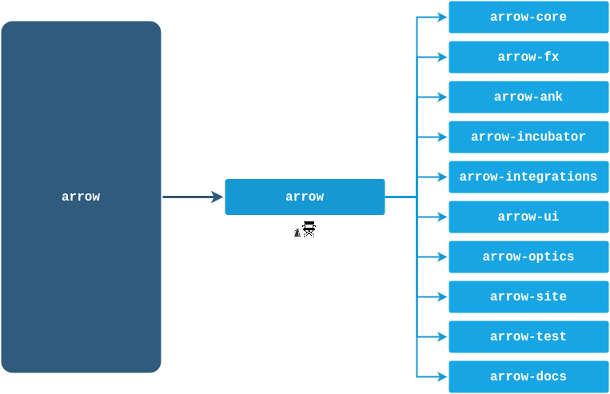

# Move arrow repository content to multi-repo

The mono-repo was a blocking point for the future of Arrow and some changes couldn't be implemented because of having a single project with all the libraries. For instance, changes related to type checking.

The multi-repo introduces some challenges with breaking changes in several Arrow libraries that are being counteracted with global checks after merging changes and a development environment to check crossed changes.

However, the benefits of having single Arrow libraries will allow to implement improvements in type management that will take Arrow to the next level.

Find details about the re-organization from mono-repo to multi-repo:

- [Repositories organization](repositories-organization.md)
- [How it works](how-it-works.md)
- [How to move a PR from arrow repository to a new repository](how-to-move-a-pr.md)
- [How to manage several repositories](how-to-manage-several-repositories.md)

Making of:

- [Implementation plan](implementation-plan.md)
- [Compilation dependencies](compilation-dependencies.md)
- [How to create secrets in several repositories](how-to-create-secrets.md)
- [How to extract content and to keep the Git history](how-to-extract-content.md)
- [Lessons learnt](lessons-learnt.md)
